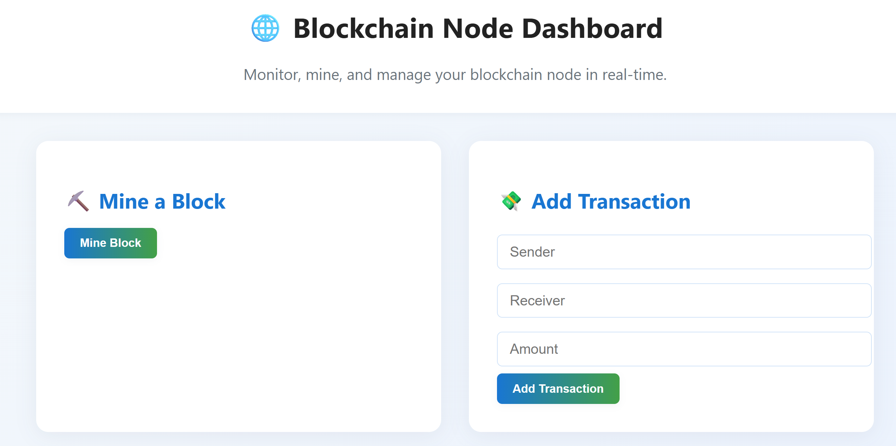
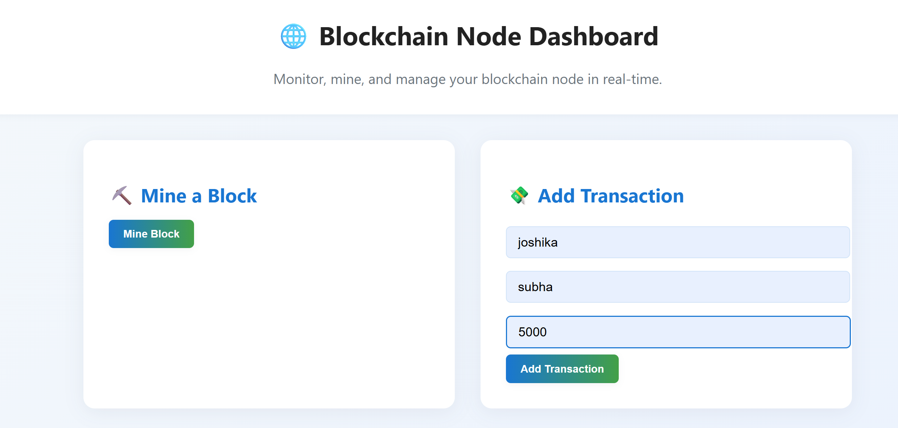
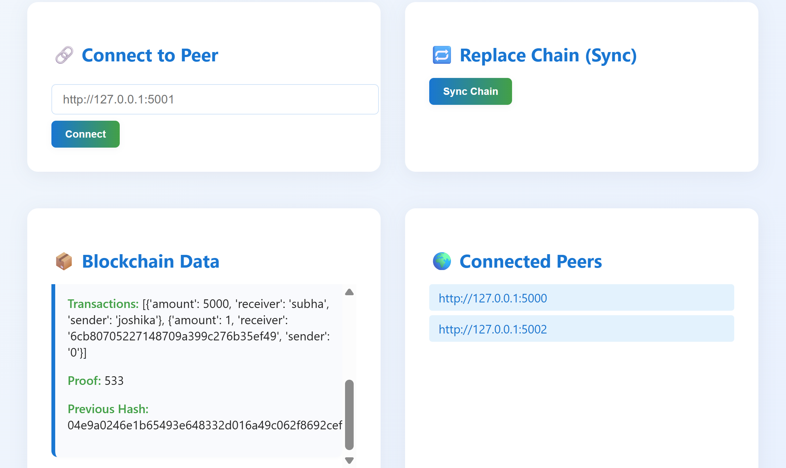

# Blockchain P2P Simulation

## Project Overview

This project is a simple simulation of a peer-to-peer (P2P) blockchain network using Python and Flask. It demonstrates the core concepts of blockchain, including mining with Proof-of-Work, transaction processing, peer discovery, and consensus through chain replacement.

Each node runs independently, maintains its own copy of the blockchain, and communicates with other nodes to synchronize the chain when needed.

## Features

- Create and mine new blocks using Proof-of-Work (PoW)
- Add transactions manually through a web interface
- Connect to peer nodes (P2P network simulation)
- Automatic or manual chain synchronization
- Simple HTML UI with periodic auto-refresh

---

## Technologies Used

- Python 3.x
- Flask (web framework)
- Requests module (HTTP communication between peers)
- HTML, CSS (UI templates)

## Project Structure

Block_Chain/
└── Block_chain/
    └── p2p_blockchain_web/
        ├── blockchain.py            # Core blockchain logic (blocks, chain, transactions)
        ├── node.py                  # Flask app + API routes (add, mine, connect, replace)
        ├── requirements.txt         # List of required Python packages
        ├── templates/
        │   └── index.html           # Web UI for interacting with node
        ├── static/
        │   └── style.css            # CSS styling for frontend

# Screenshots

## Working Demo

https://drive.google.com/file/d/1j9Nc4Mt_rIbwXVR8vwnoj6MkZ87kwAd5/view?usp=drive_link